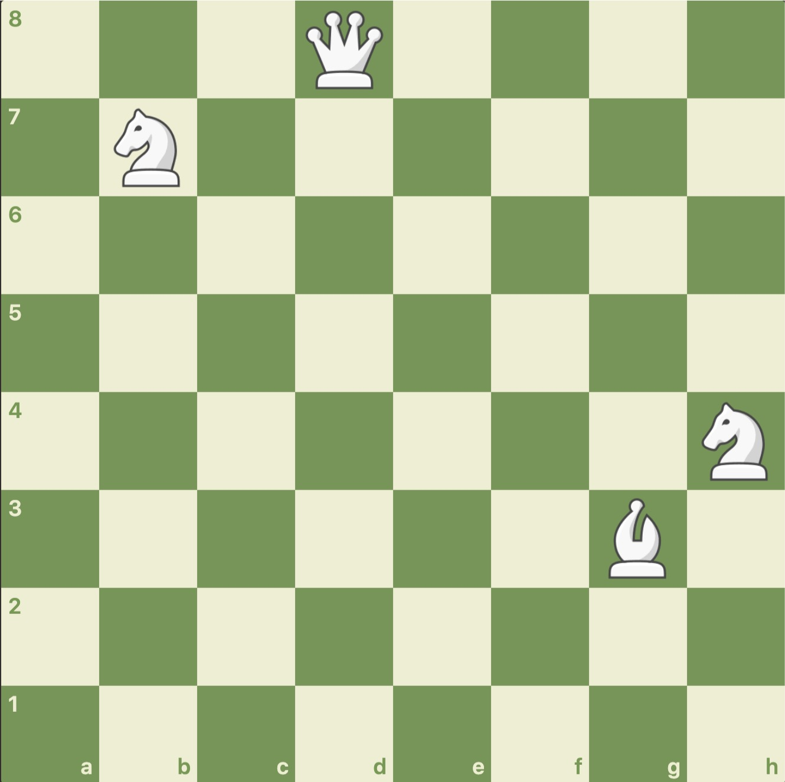
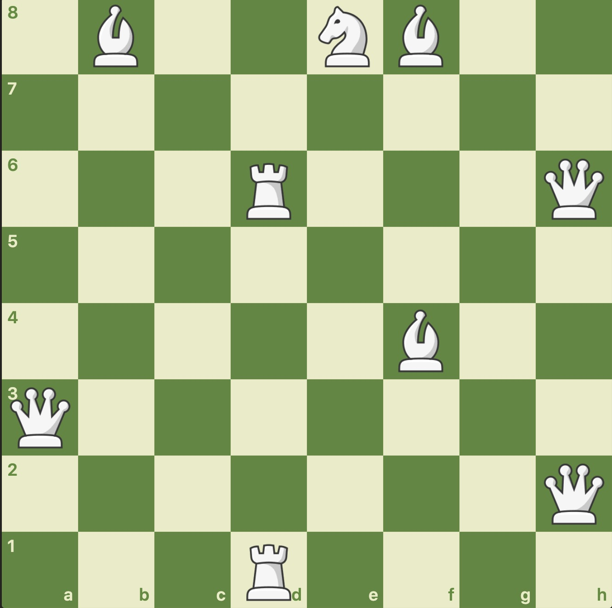

【样例$1$】

[视频链接](https://shenyouran.github.io/projects/chess/U107774/solo-1.mp4)

第一步，$G3$的象吃掉$H4$的马，此时该象仍然为白色。

第二步，$H4$的象吃掉$D8$的后，此时该象变为黑色。

第三步，$B7$的马吃掉$D8$的象。此时全局仅剩一子——马。游戏结束。

所以总共用了$3$步。

【样例$2$】

[视频链接](https://shenyouran.github.io/projects/chess/U107774/solo-2.mp4)

第一步，$E8$的马吃$D6$的车。

第二步，$F8$的象吃$D6$的马。

第三步，$B8$的象吃$D6$的象。

第四步，$H2$的后吃$F4$的象。

第五步，$F4$的后吃$D6$的象，此时变为黑色。

第六步，$D1$的车吃$D6$的后。

第七步，$H6$的后吃$D6$的车。

第八步，$A3$的后吃$D6$的后。此时全局仅剩一子——后。游戏结束。

所以总共用了$8$步。

【样例$3$】

$n=3$，而只有$2$枚棋子，所以不匹配，输出$-1$。

【样例$4$】

输入中出现了$q,p,x$等非法字符，所以格式不正确，输出$-2$。

【样例$5$】

棋局中有王，因此王必须作为最后一枚留下来的棋子。而这时王处于将军状态，且不能吃掉任何其他棋子，因此棋局无解，输出$-3$。