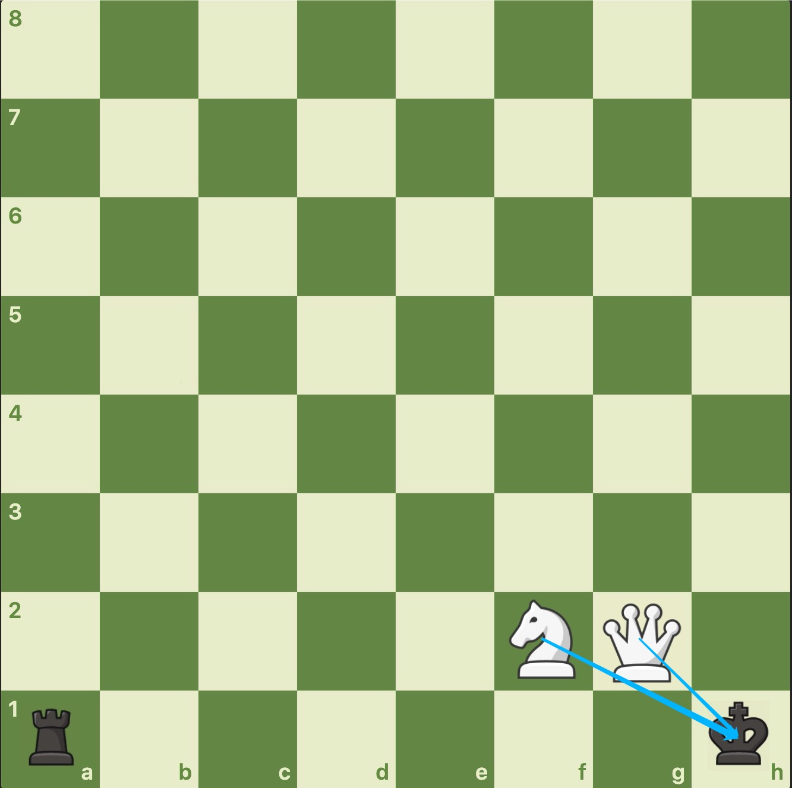
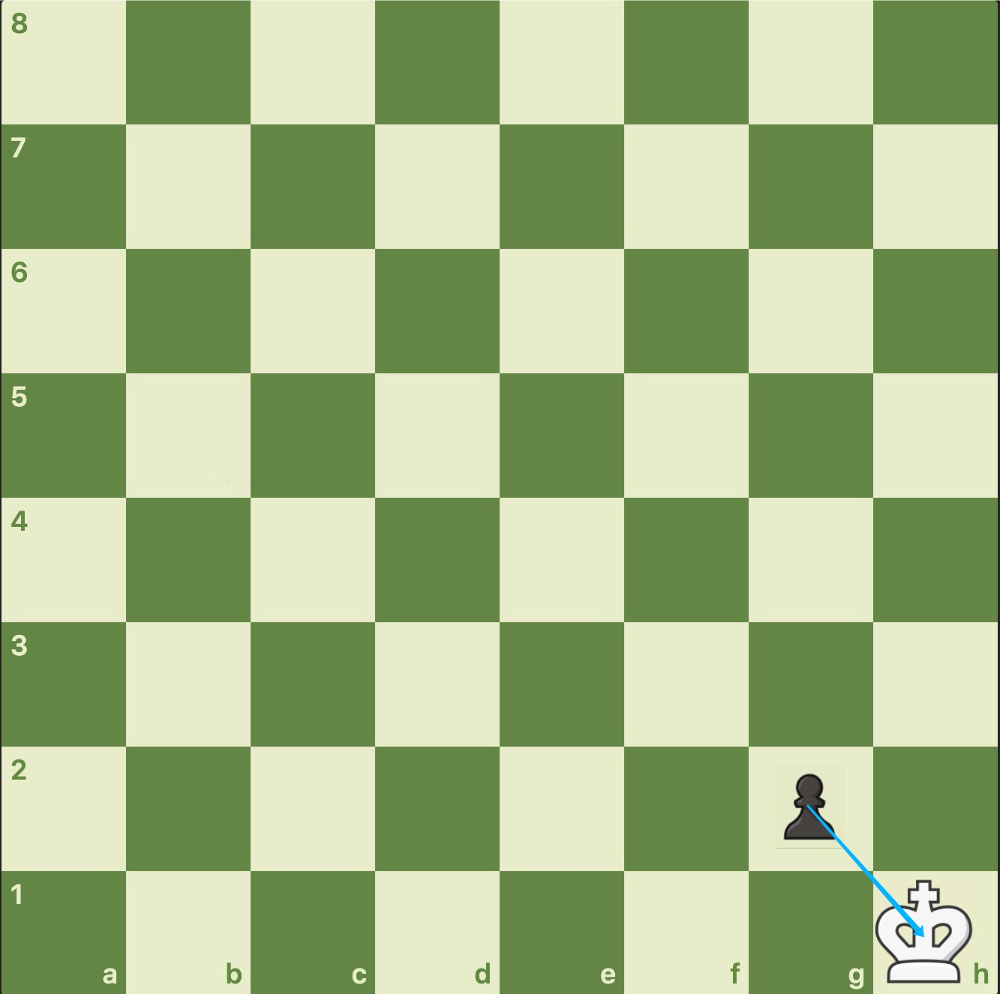
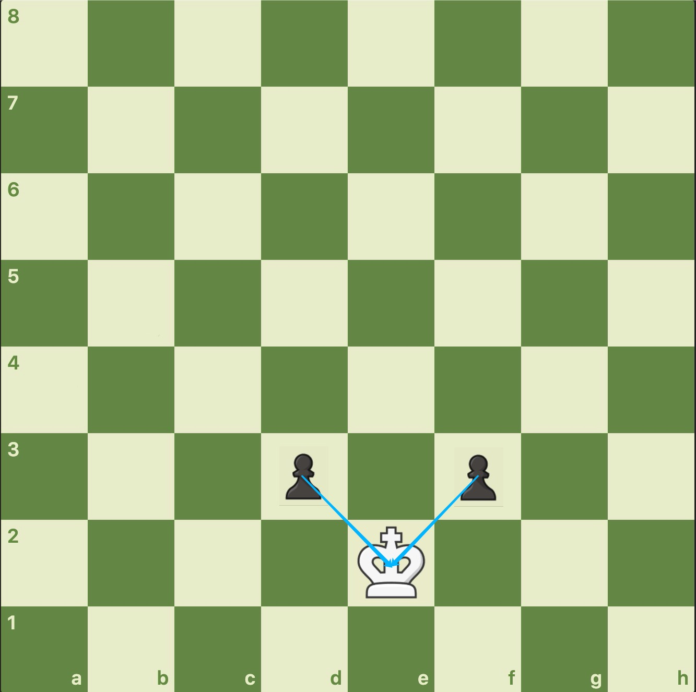

【样例$1$】



如上图，此时黑方的车位于$A1$，白方的马位于$F2$，白方的后位于$G2$，黑方的王位于$H1$。由于同方的棋子不会互吃，而王是黑方的，因此只需考虑白方的子。此时白方的马和后都在威胁。由于先后顺序的问题，因此输出两行：

```
Q+
N+
```

【样例$2$】



棋盘上有黑方的兵和白方的王。兵只能往前走（对于黑方来说就是只能从$8-1$行走。而我们是白方的视角，所以兵只能往后走，并往斜后方吃子），因此这时白方的王处于将军状态。输出一行：

```
p+
```

【样例$3$】



与样例$2$类似，此时黑方的兵在白方的视角是往斜后方吃子的，所以此时有两个黑兵都在威胁白王，即：

```
p+
p+
```